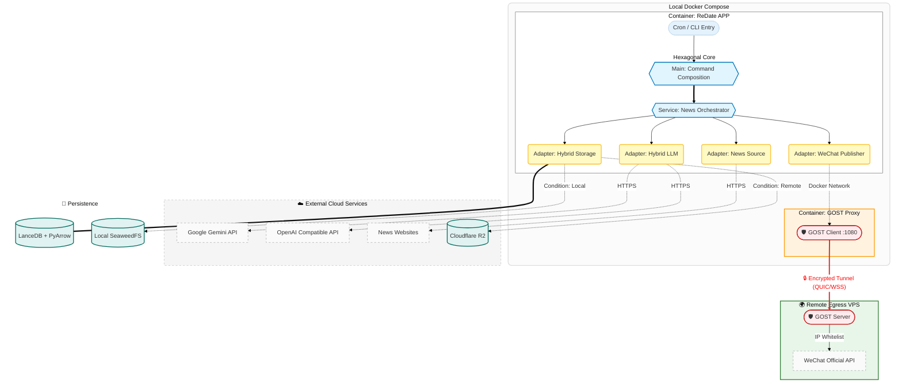

# 项目架构与设计模式

ReDate 采用 **六边形架构 (Hexagonal Architecture)**，也称为 **端口与适配器架构 (Ports and Adapterers)**。这种设计模式确保了业务逻辑的核心地位，使其不依赖于任何外部框架或基础设施。

## 1. 逻辑分层

项目的物理结构与逻辑层次严格对应，从内到外依次为：

### 核心领域层 (Domain Layer)
- **文件**: `redate/domain_models.py`
- **职责**: 定义系统中最核心的实体和数据结构。
- **特性**: 
    - 使用 Pydantic 的 `frozen=True` 模型，确保领域对象的不变性。
    - 包含业务规则相关的逻辑（如 `fingerprint` 计算）。
    - 绝对不依赖 `redate/` 下的其他模块。

### 端口层 (Ports Layer)
- **文件**: `redate/ports.py`
- **职责**: 定义基础设施必须遵守的接口契约。
- **特性**:
    - 使用 Python 的 `typing.Protocol` 实现结构化子类型（鸭子类型）。
    - 定义了 `NewsFetcher`, `StorageAdapterer`, `LLMEngine` 等核心接口。

### 业务应用层 (Application Layer)
- **文件**: `redate/service_news.py`, `redate/service_migration.py`
- **职责**: 编排业务流程（工作流）。
- **特性**:
    - 不关心具体的实现（如存入的是 R2 还是 SeaweedFS），只通过“端口”与外界交互。
    - 处理异常流程、日志记录及业务指标。

### 基础设施适配层 (Infrastructure / Adapterers)
- **文件**: `redate/adapterer_*.py`, `redate/utils_*.py`
- **职责**: 实现端口定义的接口，处理具体的外部系统集成。
- **特性**:
    - `GeminiAdapterer`: 集成 Google Gemini API。
    - `OpenAIAdapterer`: 集成 OpenAI API。未来考虑集成 OpenResponse API
    - `HybridStorageAdapterer`: 同时管理 R2 对象存储与 LanceDB 向量数据库。
    - `VikiNewsAdapterer`: 从viki API拉取不同类别的信息。
    - `HybridImageAdapterer`: 从多个可免费商用图片来源以关键词限制方式拉取图片。
    - `WeChatAdapterer`: 处理微信 API 的复杂认证与推送逻辑。
    - `utils_date`: 处理时间计算的通用工具。
    - `utils_telemetry`: 构建日志系统的通用工具，采用结构化日志和回退机制。

---

## 2. 关键设计模式

### 依赖反转 (Dependency Inversion)
高层模块（`NewsService`）不应依赖低层模块（`GeminiAdapterer`），两者都应依赖于抽象（`LLMEngine` 协议）。这种设计使得我们可以在测试时轻松注入 Mock 对象，或者在未来更换 AI 引擎。

### Result 模式 (Monadic Error Handling)
受 Rust 和函数式编程启发，我们在 `redate/domain_models.py` 中实现了 `Result[T, E]` 类型。
- 相比于抛出异常，显式的 `Ok` 和 `Err` 返回值强制调用者处理错误分支。
- 这极大提高了系统的稳健性，尤其是在处理网络不稳定的外部 API 时。

### 幂等性保障 (Idempotency)
为了防止重复抓取或发布：
1. **内容指纹**: 使用内容的 SHA-256 哈希值作为唯一标识。
2. **状态检查**: 在执行写操作前，先通过 `StorageAdapterer.check_exists` 校验是否已存在。

---

## 3. 部署架构 (Security Model)

本项目采用容器编排和固定IP代理跳板来解决安全性与网络限制问题。

### 为什么这样设计？
1. **零秘钥落地**: 代码和 API 秘钥仅存在于临时的 GitHub Runner 内存中。
2. **IP 白名单绕过**: 微信 API 需要固定 IP。通过建立到 VPS 的加密隧道，Runner 可以借用 VPS 的 IP 进行请求。
3. **攻击面最小化**: VPS 仅暴露一个加密端口，不存放任何敏感数据。

---

## 4. 数据流生命周期

1.  **Ingestion**: 抓取原始数据 -> 校验指纹 -> 清洗并保存至 R2 (归档) -> 存入 LanceDB (向量化)。
2.  **Synthesis**: 查询 LanceDB 历史上下文 -> LLM 生成报告 -> 下载配套配图。
3.  **Publication**: 适配 HTML 模版 -> 上传素材至微信 -> 创建草稿。
